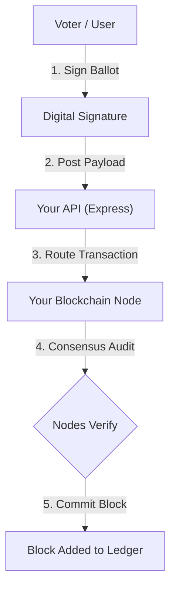
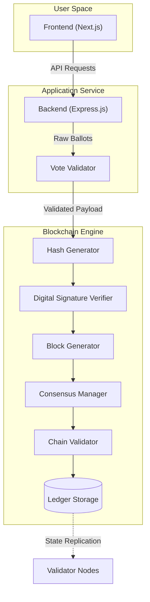

# CivicLedger — Blockchain Voting Platform

A secure, decentralized on-chain voting system built with Ethereum Smart Contracts, an Express.js/SQLite backend, and a Next.js/React frontend integrated with MetaMask and optionally Supabase.

---

## Project Structure

```
secure-vote/
├── blockchain/          # Hardhat Ethereum smart contracts (Solidity)
├── backend/             # Express.js + Prisma + SQLite REST API
├── frontend/            # Next.js 16 UI (Tailwind CSS v4, Wagmi, Viem)
├── MEMORIES.md          # Complete feature changelog and implementation notes
├── supabase_schema.sql  # Supabase tables schema (if using cloud DB)
└── package.json         # Root scripts for running all services
```

---

## Custom Blockchain & Consensus Architecture (Alternative Path)

While this project currently utilizes Ethereum smart contracts (via Hardhat/EVM) and MetaMask, transition to a custom permissioned blockchain is a highly viable alternative for institutional elections. This model eliminates the need for third-party browser extensions like MetaMask by handling key management or local signature generation.

### Transaction Lifecycle Flow



> [!NOTE]
> In this implementation route, client-side MetaMask interaction is replaced by a native signature verification API or dedicated key-management service (KMS).

### Consensus Mechanism Options

Building a permissioned network for elections avoids the energy-intensive mining of public blockchains (Proof of Work). Instead, the system uses modern, lightweight consensus models:

* **Proof of Authority (PoA) — *Recommended for Elections***
  Only pre-authorized validator nodes (e.g., trusted election servers, independent oversight bodies) can validate transactions and mint blocks. This provides fast finality, low latency, and zero gas-fee reliance.
* **Practical Byzantine Fault Tolerance (PBFT)**
  A standard model for consortium blockchains. It ensures nodes reach consensus as long as two-thirds of the network behaves honestly, offering instant block finality.
* **RAFT**
  A leader-based consensus algorithm that is simple, clean, and highly performant. Best suited for fully trusted environments where Byzantine fault tolerance is not required.

### Proposed System Architecture



---

## Prerequisites

Make sure the following are installed on your machine:

| Tool | Version | Purpose |
|------|---------|---------|
| Node.js | v18+ | All services |
| npm | v9+ | Package management |
| MetaMask | Latest | Browser wallet for signing transactions |

---

## Environment Files Setup

> ⚠️ These files are **NOT committed to Git** — you must create them manually.

### 1. Backend env — `backend/.env`

Create the file `backend/.env` with these exact contents:

```env
DATABASE_URL="file:./dev.db"
JWT_SECRET="supersecretjwtkey12345!votingplatform"
PORT=5000
```

- `DATABASE_URL`: Path to the SQLite database file (auto-created on first run).
- `JWT_SECRET`: Secret key for signing JWT tokens. Change this to a secure random value in production.
- `PORT`: Port the Express server runs on (default 5000).

---

### 2. Frontend env — `frontend/.env.local`

Create the file `frontend/.env.local`:

**Option A — Use Supabase Cloud (recommended for shared development):**
```env
NEXT_PUBLIC_SUPABASE_URL=https://your-project-id.supabase.co
NEXT_PUBLIC_SUPABASE_PUBLISHABLE_KEY=sb_publishable_your_key_here
```

**Option B — Use local SQLite only (no Supabase account needed):**
```env
# Leave this file empty, or don't create it at all.
# The app will automatically fall back to the local Express/SQLite server.
```

> The Supabase keys can be found in your Supabase project → Settings → API.

---

## Installing Dependencies

Run this in each directory (you only need to do this once):

```bash
# Install root dev tools
npm install

# Install blockchain dependencies
cd blockchain && npm install && cd ..

# Install backend dependencies
cd backend && npm install && cd ..

# Install frontend dependencies
cd frontend && npm install && cd ..
```

---

## Running the Application

Open **4 separate terminal windows** in the project root and run each command in sequence:

### Terminal 1 — Local Ethereum Blockchain Node
```bash
npm run hardhat:node
```
This starts a local Ethereum simulator at `http://127.0.0.1:8545`. Keep this running.  
It also prints 20 test wallet accounts with their private keys — **save these**.

### Terminal 2 — Deploy Smart Contract
```bash
npm run hardhat:deploy
```
Deploys `SecureVote.sol` to the local blockchain. The contract deploys to address:
```
0x5FbDB2315678afecb367f032d93F642f64180aa3
```
This address is already set in `frontend/src/config/contract.ts`. Only re-deploy if you modify the contract.

### Terminal 3 — Backend Server
```bash
# First time only: create SQLite database and seed default admin/voter accounts
npm run backend:seed

# Start the backend server (runs at http://localhost:5000)
npm run backend:dev
```

### Terminal 4 — Frontend Dev Server
```bash
# Runs at http://localhost:3000
npm run frontend:dev
```

---

## Default Login Credentials

### Admin Dashboard
- **URL:** `http://localhost:3000/admin/login`
- **Email:** `admin@securevote.com`
- **Password:** `adminpassword123`
- **MetaMask Account:** Hardhat Account #0

### Test Voter Accounts (pre-seeded)
These are registered in the SQLite database as **pre-verified** (`verificationStatus: "verified"`) and can authenticate via their wallets:
- **Alice Johnson** → Hardhat Account #1 (`0x70997970C51812dc3A010C7d01b50e0d17dc79C8`)
- **Bob Smith** → Hardhat Account #2 (`0x3C44cDDdB6a900fa2b585dd299e03d12FA4293BC`)

---

## MetaMask Setup (Required to Vote)

1. Open MetaMask → Click network selector → **Add network manually**
2. Enter these network details:
   - **Network Name:** `Hardhat Localhost`
   - **RPC URL:** `http://127.0.0.1:8545`
   - **Chain ID:** `1337`
   - **Currency Symbol:** `ETH`
3. Import a test account:
   - From the `npm run hardhat:node` terminal output, copy any account's **Private Key**
   - MetaMask → Profile icon → **Import Account** → Paste the private key

---

## Application Routes

| URL | Description |
|-----|-------------|
| `http://localhost:3000/` | Public homepage — lists active elections |
| `http://localhost:3000/login` | Voter login (2-step: wallet connection & cryptographic signature) |
| `http://localhost:3000/register` | Voter self-registration (includes automatic Ethereum wallet generator) |
| `http://localhost:3000/profile` | 3-state voter status page (Pending stepper, Verified dashboard, or Rejected notice) |
| `http://localhost:3000/elections/:id/vote` | Cast ballot page (with 5-step blockchain progress stepper) |
| `http://localhost:3000/elections/:id/results` | Election tabulation, percent bars, and declared winner |
| `http://localhost:3000/verify` | Public audit ledger showing real-time blockchain verification timeline |
| `http://localhost:3000/admin/login` | Admin login page |
| `http://localhost:3000/admin/dashboard` | Admin panel (Elections, Candidates, Voter Directory, and Verification Queue) |

---

## Voter Registration & Verification Flow (End-to-End)

1. **Self-Registration (`/register`):**
   - The voter fills in their Name, Email, and Wallet Address.
   - If they do not have an external wallet (like MetaMask), they can use the built-in **Ethereum Wallet Generator** (utilizing `viem`) to instantly create a new wallet in-browser.
   - Once submitted, their profile status is set to `pending`.

2. **Voter Authentication & Login (`/login`):**
   - The voter connects their Ethereum wallet (MetaMask or private key).
   - They perform a **2-step login** by signing a cryptographic message to verify ownership and receive a JWT session token.

3. **Pending Status Check (`/profile`):**
   - After logging in, the voter is redirected to `/profile`.
   - If their status is `pending`, they see a visual registration submission progress stepper.

4. **Administrator Verification Queue (`/admin/dashboard`):**
   - The administrator logs in and opens the **Verification Queue** tab.
   - The administrator inspects pending registrations and chooses to **Approve** (sets status to `verified`) or **Reject** them (with optional notes detailing the reason).
   - *If rejected*, the voter's `/profile` page shows a disclaimer box with the rejection notes. The voter can correct details and re-submit.
   - *If verified*, the voter becomes eligible for election whitelisting.

5. **On-Chain Whitelisting:**
   - On the Admin Dashboard, the administrator clicks **Whitelist** for the voter for a specific election, triggering the smart contract's `registerVoter` function.

6. **Ballot Casting:**
   - Once verified and whitelisted, the voter's `/profile` displays active elections.
   - Clicking "Go Vote" navigates to `/elections/:id/vote`, where they select their candidate and complete a **5-step blockchain progress stepper** to sign and commit their ballot on-chain.

---

## Admin Actions Summary

From the Admin Dashboard (`/admin/dashboard`):
- **Elections Management:** Create elections (synced on-chain + off-chain) and start/end elections on-chain.
- **Candidate Mapping:** Assign candidates with descriptions/photos to specific elections (before starting).
- **Voter Verification Queue:** Review, approve, or reject (with feedback notes) new voter applications.
- **On-Chain Whitelisting:** Register verified voters' addresses on the contract per election.
- **Registered Voters Directory:** View and manage the database directory, including the option to **Delete voter profiles** via the trash icon.

---

## Supabase Cloud Database (Optional)

If you want to use Supabase instead of local SQLite for shared team development:

1. Create a free project at [supabase.com](https://supabase.com)
2. Open the **SQL Editor** in your Supabase project
3. Paste and run the contents of `supabase_schema.sql` to create all tables
4. Copy your project URL and publishable key from **Settings → API**
5. Add them to `frontend/.env.local` (see Environment Files section above)

> ⚠️ When Supabase is configured, the frontend skips the local Express backend for database queries and talks directly to Supabase. The blockchain layer (Hardhat + smart contract) always runs locally regardless.

---

## Key Files for Development

| File | Purpose |
|------|---------|
| `blockchain/contracts/SecureVote.sol` | The Solidity smart contract |
| `blockchain/scripts/deploy.ts` | Deployment script |
| `backend/prisma/schema.prisma` | SQLite database schema |
| `backend/src/controllers/` | All API endpoint logic |
| `backend/src/routes/` | Express route definitions |
| `frontend/src/config/contract.ts` | ABI + contract address |
| `frontend/src/config/supabase.ts` | Supabase client config |
| `frontend/src/store/authStore.ts` | Zustand auth state |
| `frontend/src/components/Header.tsx` | Top navigation |
| `frontend/src/components/Sidebar.tsx` | Collapsible side nav |
| `MEMORIES.md` | Detailed changelog of all features added |

---

## Common Issues

**"Cannot connect to RPC" in MetaMask**
→ Make sure `npm run hardhat:node` is running and MetaMask is on the `Hardhat Localhost` network.

**Backend 500 errors / "table not found"**
→ Run `npm run backend:seed` to create and seed the SQLite database.

**Frontend shows blank page**
→ Check that the backend is running at `http://localhost:5000` and the contract address in `contract.ts` matches the deployed address.

**Supabase "table not found" errors**
→ Make sure you ran `supabase_schema.sql` in your Supabase SQL Editor.
